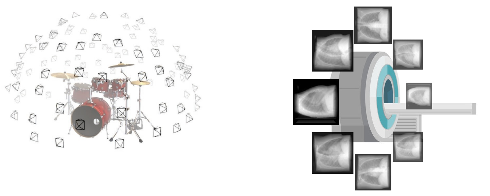
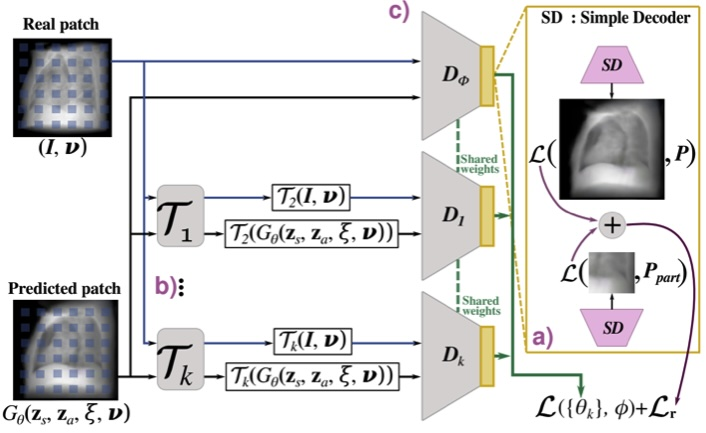
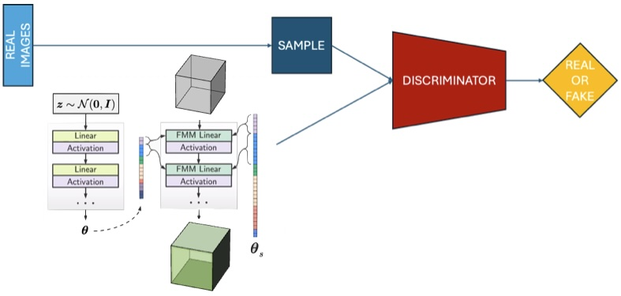
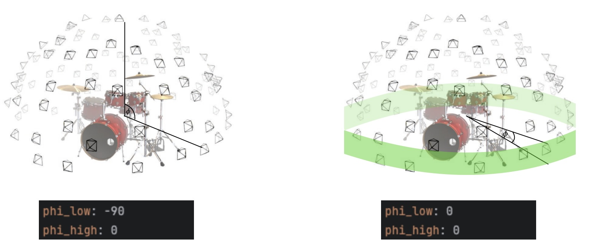
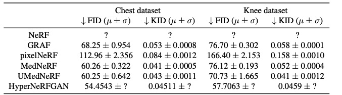

# NerfGUI

Graphical user interface presenting results from two projects: Sampling in NeRF and Mednerf.

<a href="https://github.com/MarcinKadziolka/nerf-gui">Click for live demo</a>, where you can visualize rendered images:

## What is NeRF?
Neural Radiance Fields (NeRF) are a groundbreaking technology that allows us to generate new, high-quality views of a scene from just a few dozen images. Imagine being able to see a scene from any angle after only having a handful of pictures—this is the magic of NeRF.

Here's a basic example: you start with a few photos of an object or scene.

NeRF can then generate a completely new, previously unseen image of the scene.

## How does NeRF work?

NeRF tackles the challenge in three main steps:

### 1. March rays and sample points

Rays are projected through the scene from the camera's perspective. Points along these rays are sampled, with each point described by its coordinates and the camera's viewing direction.

### 2. Get colors and densities

The NeRF model predicts the color and density for each sampled point. Density helps in identifying whether a point lies on the surface of an object or in empty space.

### 3. Render colors and compare

The model accumulates the sampled colors, considering only those with high density to render the final image. The predicted output is compared to the real image, and the error is minimized through gradient descent.

### But how we do get the representation?

This iterative process is performed thousands of times, typically utilizing 40-70 images, each with dimensions of 400x400 pixels. Rays are projected through every pixel, enabling the model to differentiate between various points within the scene. In simpler terms, if the model observes a point appearing yellow from one angle and predicts it to be yellow from a different angle, there's a high likelihood that this point retains its yellow color when viewed from the intermediate angle.

### Rendering

After successful training, every possible view can be rendered at will.

### Why improve NeRF?

While NeRF is revolutionary, it has its limitations. The process is slow because it requires evaluating thousands of samples, making real-time rendering infeasible. Wouldn’t it be great if we could sample exactly where we need and speed up the process?

## Our Work: Enhancing NeRF Sampling

### Current Sampling in NeRF

The traditional NeRF sampling process involves two stages:

1. Initial Uniform Sampling: Rays are divided into equal segments, and points are sampled uniformly.
2. Resampling in Dense Areas: After initial sampling, points are resampled based on density estimates to focus on important regions.

### First stage: Initial uniform sampling

Firstly, the ray is divided into N equal bins along its length. Then, for each bin, we sample once with uniform probability between the ends. Why? We want to make sure that we sample throughout the entire scene, but also allow the model to explore the space, which fixed sampling would prevent.

### Second stage: Resampling in dense areas

Secondly, the initial samples are sent to the NeRF model (referred to as "coarse," because it processes coarsely sampled points), which outputs RGB and $\sigma$ for each point. We aren't concerned with the color, but the information about density is very useful. Then, more points are sampled according to the retrieved piecewise-constant probability function. In this way, we ensure coverage of all the important parts of the scene.

### The issue with sampling

We aim to improve the efficiency of this process by developing a model that samples points directly in dense areas from the start. This approach can significantly reduce the number of samples needed and speed up the rendering process.

### Solution

Our initial results are promising, showing more efficient sampling and faster rendering. However, this is an ongoing project, and we are continually refining our methods to achieve even better performance.

In the application, users can view the results of different NeRF models. The "Coarse" section represents the number of points sampled uniformly along each ray. When the option "0" is chosen, the viewed results are from our model, which tries to sample directly in the dense areas. Additionally, an ablation study was done for the original NeRF, allowing users to enable or disable positional encoding and viewing direction.

## Medical

### Use Case
CT scans are commonly used in medicine to give a 3d view of patinets body, and visualise their internal organs. While they are great, they come with a fair share of drawbacks,
they take a long time and due to how they work, each exam causes patients body to absorb a small dose of radiation, which can accumulate over multiple exams.
Neural networks can be used to generate a 'CT Scan like' projections based of off single 2D x-ray.

### NeRF in medical imaging
NeRFs, due to they high resolution and ability to resolve geometry and volume are good candidates for replicating CT Scans, but since NeRF is only a representation of a object, it needs to be combined with a generative model like GAN.

### Medical vs Synthetic data

Compared to synthetic data which is usually used to evaluate model performance, medical datasets are based off of CT scans, which sample data only in one axis.
 

### MedNeRF

MedNeRF utilizes GRAF based model to produce accurate 3D projections from few or single view x-ray. GRAF uses SIREN to generate
shape and appearance vectors used to describe predicted NeRF patch for a given view angle. Due to training GAN on medical datasets which, due to their nature are usually quite small, a number of issues,
such as mode collapse can occur. The authors solve that by combining GRAF with DAG and using multiple discriminator heads.
 

### Hyper NeRFGAN

HyperNeRFGAN builds from INR GAN model by replacing INR model with NeRF.

Generator takes the sample from Gaussian distribution and returns the set of parameters Θ.These parameters are further used inside the NeRF model
FΘ to transform the spatial location x = (x, y, z) to emitted color c = (r, g, b) and volume density σ. Θ is split into two parts Θ which is generated for each representation and Θs which is share by all of them.

#### Adapting model to use medical case

 
To evaluate a model for the medical application and ensure comparability with existing methodologies, we use a dataset employed in the MedNeRF containing digitally reconstructed radiographs (DRR) with 20 examples for chest and 5 examples for knee, each consisting of 72 128×128 images taken every 5 degrees, covering full 360-degree vertical rotation per patient. To account
for differences between synthetic and medical datasets we change the sampling angle to only cover one axis as the MedNeRF authors did, and change the model configuration to not assume a white background for the training data. We train the model on a single example for each experiment.

### Experiments

We performed ablation study investigating ways to improve model results. We've experimented with implementing stylegan2 augmentations, changed the number of feature maps and implememted nerf viewing directions
### Viewing dir
Experiments with NeRF shown that omiting viewing dir can lead to faster training times, at a cost of no shadow representation. Since in the medical case shadows are nonexistent this can be a feasable way to speed up the training.

### Augmentations
MedNeRF utilized augmentations to greatly improve results, therefore its worth investigating if they will improve HyperNeRFGAN as well

### Results
Compared to other models, HyperNeRFGAN achieves significantly better results, leading to higher quality projections from single view x-ray.
 

Ablation study shows, that omiting viewing directions, has a negative impact on quality of generated projections, while the positive impact of
implementing augmentations is neglible.
